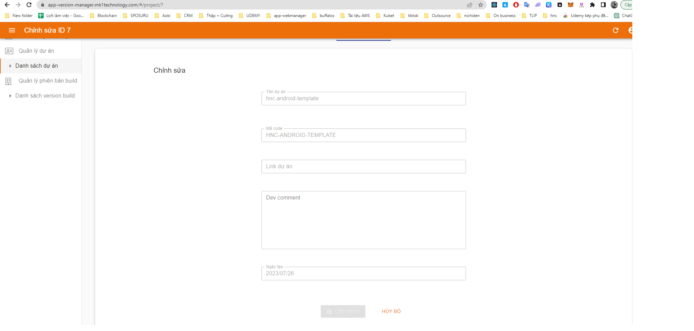

# APP Manager

Hướng dẫn sử dụng trang quản lý version app

## Developer

IOS dev: 
```
B1: Tạo respository cho project 
B2: Cài đặt CI/CD cho project sử dụng jenkins
B3: Upload file build .ipa lên Amazon S3 bucket (jenkins-management) 
với định dạng: {Tên dự án}/{Tên dự án}_{Môi trường}_{version app}_{STT build}_ {ngày build}_{giờ build}.ipa
ví dụ: 	hnc-ios-template/HncTemplate_develop_1.0.2_2_20230728_075138.ipa
```
Android dev: 
```
B1: Tạo respository cho project 
B2: Cài đặt CI/CD cho project sử dụng Git Actions
B3: Upload file build .ipa lên Amazon S3 bucket (jenkins-management) 
với định dạng: {Tên dự án}/{Tên dự án}_{Môi trường}_{version app}_{STT build}_ {ngày build}_{giờ build}.apk
ví dụ: 	hnc-android-template/HncTemplate_develop_1.0.2_2_20230728_075138.apk
```
## Tester-BA-Brse-dev
```
B1: Truy cập vào đường dẫn
https://app-version-manager.mk1technology.com/

B2: Nhập username/password đã được admin cấp
B3: Click Quản lý dự án để xem danh sách các dự án hiện đang có 
B4: Click Quản lý phiên bản build để xem danh sách các bản build đã được build
B5: Click TẠO QR CODE ở mỗi bản build để tạo QR code
B6: Sử dụng thiết bị test mở carema và quét QR code đã được tạo
```
### Login


### Danh sách project 


### Danh sách version 


### Tạo QR code


### Dev note cho Project 


### Dev và tester comment build 

